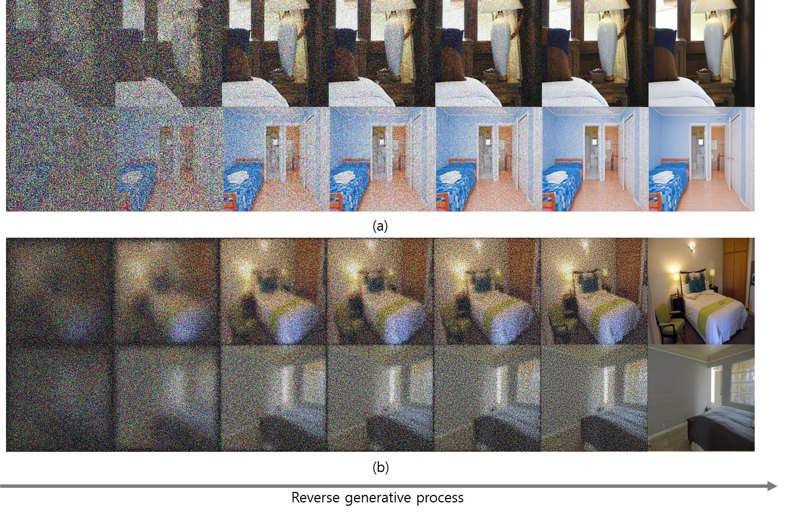

# blur-diffusion

This is the codebase for Progressive Deblurring of Diffusion Models for Coarse-to-Fine Image Synthesis.
## Train
```bash train.sh```
## Visualization
```bash eval_x0hat.sh```
## Dataset
Image files are required to compute FID during training.
